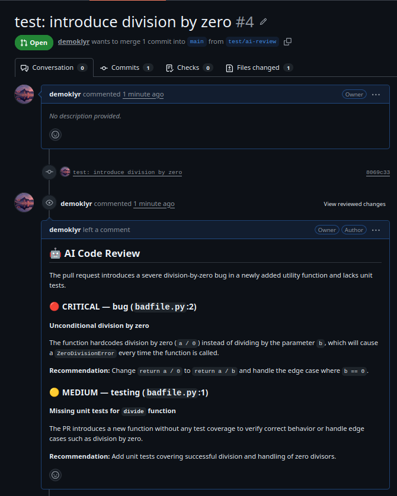

# 🤖 AI Code Reviewer (AI-powered automation pipeline)

**AI-powered GitHub Pull Request reviewer built with FastAPI, Gemini, GitHub Webhooks, Pydantic, Docker and GitHub Actions.**

[](https://github.com/demoklyr/ia-pull-request-reviewer/actions/workflows/ci.yml)


---

## The problem

Code review is one of the highest-leverage activities in software engineering — and one of the most inconsistent. Senior engineers are a scarce, expensive resource, reviews get rushed under deadline pressure, and the same categories of bugs (SQL injection, unhandled edge cases, missing tests) slip through again and again because a human reviewer is tired, in a hurry, or simply didn't have the full context loaded.

**AI Code Reviewer** acts as a first line of defense: every time a Pull Request is opened or updated, it automatically analyzes the diff with an LLM and publishes a structured review directly on GitHub — before a human even looks at it. It doesn't replace a senior reviewer's judgment on architecture and design; it catches the mechanical, well-defined issues instantly and for free, so human review time gets spent on what actually needs a human.

## Features

-  Listens for GitHub Pull Request events (`opened`, `synchronize`) via webhook
-  Fetches the real PR diff through the GitHub API
-  Sends it to an LLM (Gemini) with a structured prompt covering 5 categories:
  bugs, security, performance, best practices, and missing tests
-  Validates the LLM's output against a strict schema (Pydantic) — a malformed
  or hallucinated response is rejected rather than published
-  Publishes a readable, emoji-coded review as a PR comment
-  Verifies GitHub's webhook signature (HMAC-SHA256) — rejects unauthenticated requests
-  Fully containerized (Docker + Docker Compose)
-  Tested end-to-end with mocks — no real API key needed to run the test suite
-  CI on every push (GitHub Actions)


## What I learned building this

- **LLM integration in a real pipeline** — the hard part isn't calling the API, it's designing a prompt that reliably returns a fixed JSON schema, and building a validation layer (Pydantic) that rejects the LLM's output when it doesn't comply, instead of trusting it blindly.
- **Webhooks & signature verification** — understanding the push model (GitHub calls *you*, not the other way around), and why verifying `X-Hub-Signature-256` with a constant-time HMAC comparison matters: without it, anyone who finds your URL can trigger fake reviews.
- **FastAPI & dependency injection** — using `Depends()` not just to wire real services, but as a testing seam: overriding `GitHubClient`/`AIReviewer` in tests with `app.dependency_overrides` made it possible to test the entire webhook flow with zero real network calls. Also learned the hard way that FastAPI resolves dependencies *before* route logic runs — a naive dependency that builds an API client eagerly can crash requests that never needed it.
- **Docker** — multi-stage builds to keep the runtime image lean (build tools stay in the builder stage), running as a non-root user, and wiring a `HEALTHCHECK` that actually reflects the app's real liveness endpoint.
- **ngrok** — the simplest way to let a third-party service (GitHub) reach a webhook running on a local machine during development, before a real deployment exists.
- **Pydantic v2** — using `Enum` fields to constrain LLM output to a closed set of valid values, `Field(default_factory=list)` to avoid the classic mutable-default bug, and `model_validate()` as the single point where "untrusted external data" becomes "data my code can trust."


## Architecture

```
GitHub Pull Request
        |
        | Webhook (signed, HMAC-SHA256)
        v
    FastAPI API  ───────────────  POST /webhook
        |
        v
  GitHub Client  ── get_pull_request_diff() ──►  GitHub API
        |
        v
   AI Review Engine
        |
        v
    Gemini LLM  ── structured JSON ──►  Pydantic validation
        |
        v
   Markdown formatter
        |
        v
  GitHub Client  ── create_review() ──►  GitHub PR comment
```

## Tech stack

| Layer          | Technology                          |
|----------------|--------------------------------------|
| Language       | Python 3.12+                         |
| Web framework  | FastAPI                              |
| Validation     | Pydantic v2 / pydantic-settings      |
| LLM            | Gemini API (`google-genai`)          |
| HTTP client    | httpx (async)                        |
| Testing        | pytest, pytest-asyncio, respx        |
| Containers     | Docker, Docker Compose               |
| CI/CD          | GitHub Actions                       |
| Tunneling (dev)| ngrok                                |

## How it works

1. GitHub sends a `pull_request` webhook event when a PR is opened or a new commit is pushed.
2. The signature is verified — requests that aren't really from GitHub are rejected with `401`.
3. If the event/action is relevant, `GitHubClient.get_pull_request_diff()` fetches the raw diff.
4. The diff is embedded in a prompt (`ai/prompts.py`) and sent to Gemini.
5. Gemini's response is parsed as JSON and validated against the `ReviewResult` Pydantic model — any malformed response is rejected rather than published.
6. The validated result is rendered as Markdown (`ai/formatting.py`).
7. `GitHubClient.create_review()` publishes it as a comment on the PR.




## Installation

```bash
git clone https://github.com/<your-username>/ai-code-reviewer.git
cd ai-code-reviewer
python3 -m venv .venv
source .venv/bin/activate      # Windows: .venv\Scripts\activate
pip install -e ".[dev]"
```

## Environment variables

Copy `.env.example` to `.env` and fill in:

| Variable                 | Description                                                              |
|---------------------------|---------------------------------------------------------------------------|
| `GEMINI_API_KEY`         | API key for Gemini — [get one here](https://ai.google.dev/gemini-api/docs/api-key) |
| `GITHUB_TOKEN`           | Personal access token with `pull requests: read & write` permission      |
| `GITHUB_WEBHOOK_SECRET`  | Secret configured on the GitHub webhook, used to verify signatures       |
| `APP_ENV`                | `development` or `production`                                            |
| `LOG_LEVEL`              | e.g. `INFO`                                                               |

## Running locally

```bash
uvicorn ai_code_reviewer.main:app --reload --port 8000
```

To receive real GitHub webhooks on your machine, expose the port with [ngrok](https://ngrok.com):

```bash
ngrok http 8000
```

Then set the ngrok URL + `/webhook` as the Payload URL in your repo's **Settings → Webhooks**, with content type `application/json` and the "Pull requests" event selected.

## Docker

```bash
docker compose up --build
```

The API is then available on `http://localhost:8000`, with a `/health` endpoint used for the container healthcheck.

## Testing

```bash
pytest -v
```

The full suite runs with **zero real network calls**: GitHub's API is mocked with `respx`, and the LLM client is swapped for a fake via dependency injection — no `GEMINI_API_KEY` or `GITHUB_TOKEN` needed to run the tests.

## CI/CD

Every push and Pull Request triggers a GitHub Actions workflow (`.github/workflows/ci.yml`) that installs the project and runs the full pytest suite.

## Project structure

```
ai-code-reviewer/
├── src/ai_code_reviewer/
│   ├── main.py            # FastAPI app entrypoint
│   ├── config.py          # Settings (env vars)
│   ├── api/
│   │   ├── routes.py       # /health, /webhook
│   │   └── security.py    # webhook signature verification
│   ├── github/
│   │   └── client.py      # GitHub API client
│   ├── ai/
│   │   ├── prompts.py     # LLM prompt template
│   │   ├── reviewer.py    # LLM call + validation pipeline
│   │   └── formatting.py  # ReviewResult -> Markdown
│   └── models/
│       └── review.py      # Pydantic schema (ReviewIssue, ReviewResult)
├── tests/
├── .github/workflows/ci.yml
├── Dockerfile
└── docker-compose.yml
```

## Limitations

- No frontend/dashboard — GitHub itself is the UI.
- Single LLM provider (Gemini); no fallback if the API is down or rate-limited.
- Reviews every relevant PR event; no filtering by file type, PR size, or author.
- No persistence — nothing is stored between runs (no history, no analytics).

## Future improvements

**V2:** RAG on the repository's own documentation, Git history analysis, automatic test-coverage checks, GitHub Checks API integration, a PR quality score, regression detection, Semgrep-based security analysis, multi-LLM support, a web dashboard, observability.

**V3:** Multi-agent review (dedicated security/performance/testing/architecture agents + a final reviewer agent), a scoring system, and benchmarking of reviewer accuracy.

## Contributors

- [Mustapha Oumeziane](https://github.com/demoklyr)

## License

[MIT](LICENSE)
